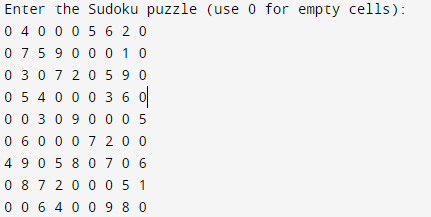
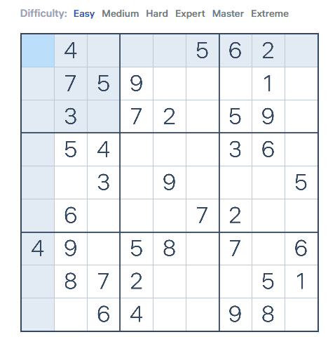
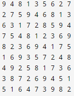

# Sudoku Solver

This repository contains a C++ program that solves Sudoku puzzles using a backtracking algorithm. The solver takes a partially filled Sudoku grid as input and provides a solution if one exists.

## How It Works

The program uses a backtracking approach to solve the Sudoku puzzle. It recursively tries all numbers in each unassigned cell and backtracks if no number fits.

## Features

- Input a 9x9 Sudoku puzzle.
- Outputs the solved Sudoku grid.
- Provides sample images for understanding the input format and the solved output.

## Getting Started

### Prerequisites

- C++ Compiler (GCC, Clang, etc.)

### Usage

1. Clone the repository:
    ```bash
    git clone https://github.com/pkprajapati7402/Sudoku-Solver.git
    cd Sudoku-Solver
    ```

2. Compile the program:
    ```bash
    g++ -o sudoku_solver sudoku_solver.cpp
    ```

3. Run the executable:
    ```bash
    ./sudoku_solver
    ```

4. Enter the Sudoku puzzle (use 0 for empty cells) when prompted.

### Input Format

The program expects a 9x9 grid of numbers, with `0` representing empty cells. 

**Example:**
```
5 3 0 0 7 0 0 0 0
6 0 0 1 9 5 0 0 0
0 9 8 0 0 0 0 6 0
8 0 0 0 6 0 0 0 3
4 0 0 8 0 3 0 0 1
7 0 0 0 2 0 0 0 6
0 6 0 0 0 0 2 8 0
0 0 0 4 1 9 0 0 5
0 0 0 0 8 0 0 7 9
```

Refer to the image below for a visual representation of the input format:



### Output

If the puzzle has a solution, it will be displayed as a 9x9 grid. If there is no solution, the program will output a message indicating so.

Refer to the images below for sample input and output:




## Sample Execution


## License

This project is licensed under the MIT License. See the [LICENSE](LICENSE) file for details.

---

Feel free to customize this README further to suit your needs!
